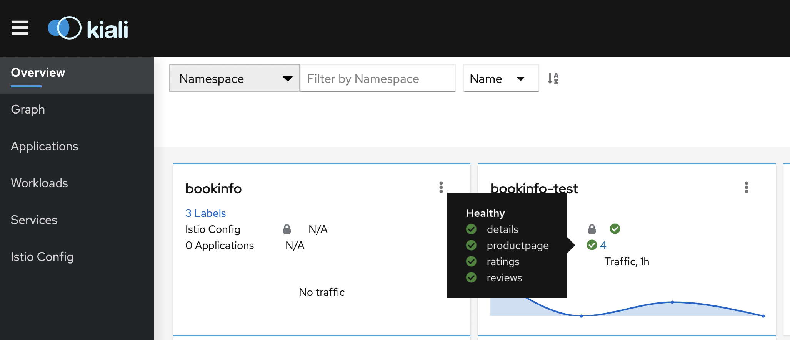
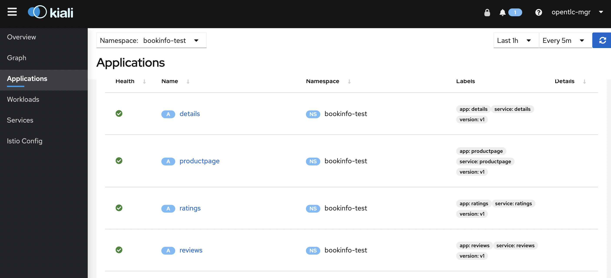
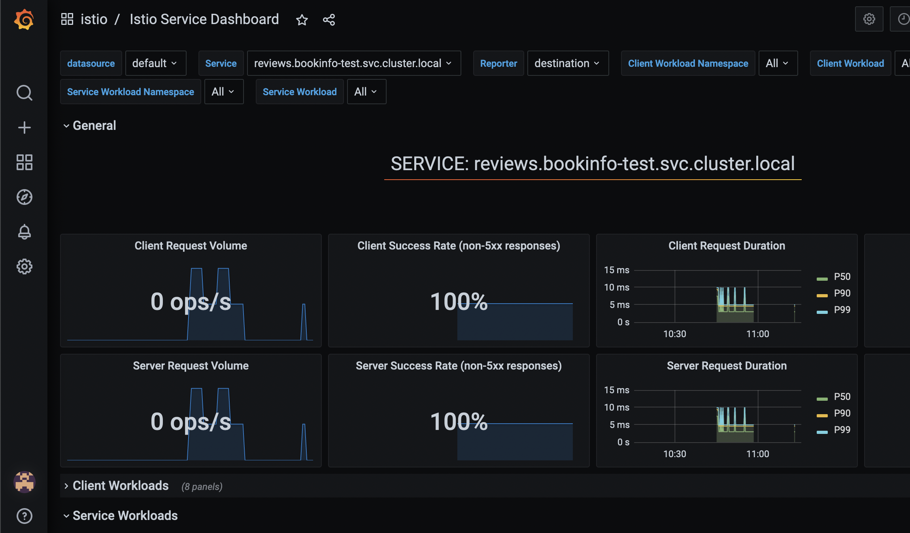

# Example GitOps-managed Service Mesh

Use this repository as a starting point to manage a Service Mesh on an OpenShift cluster.

## Getting Started

1. Clone this example repository.

2. Configure the example ArgoCD `Application` by providing your new repository URL `spec.source.repoURL` in the following files:

    ```
    bootstrap/instance/application.yaml
    apps/application-service-mesh.yaml
    ```

3. Provision the ArgoCD operator:

    ```
    oc apply -k bootstrap/operator
    ```

4. Provision the ArgoCD `Application`:

    ```
    oc apply -k bootstrap/instance
    ```

## Observation

The demo bootstrap initiates a default ArgoCD instance hosted in the `openshift-gitops` namespace. In this namespace a `Route` is deployed which provides a URL to the ArgoCD console.


## Onboarding an application to the Service Mesh

The following sections will describe how to manage applications deployed to the Service Mesh with this GitOps framework.

### Requesting a new namepaces

New namespaces are added by including their definitions in `servicemesh/overlays/default/namespaces.yaml`. The namespaces `bookinfo-test` and `bookinfo-qa` are commented out there.

### Adding namespaces to a ServiceMeshMemberRoll

If you want new namespaces to be included as a member of the mesh. Add them to `servicemesh/overlays/default/servicemeshmemberroll.yaml`

### Adding ArgoCD Applications (bookinfo example)

You can define applications in the `apps` directory. Example application definitions are available for the sample bookinfo namespaces. Uncomment the lines in `apps/kustomization.yaml` to deploy those apps.

### Validating the bookinfo example

Use Kiali to visualize bookinfo traffic:

```
KIALI_URL=$(oc get route kiali -n istio-system -o jsonpath='{.spec.host}')
```
Or using openshift console: Networking->Routes->kiali

Open the URL on a browser and then click on the `bookinfo-test` app:



Make sure all services are healthy:


Call the `productinfo` page: export the ingress gateway URL into an env variable, use curl to invoke it:
```
BOOK_GW=$(oc get route istio-ingressgateway -n istio-system -o jsonpath="{.spec.host}{.spec.path}")
```
```
curl -v $BOOK_GW/productpage | grep '<title>Simple Bookstore App</title>'
```

Setup Kiali for traffic visualization by going to the left menu `Graph` then click on the drop down `Display` and select `Request Rate`, `Request Distribution`, `Namespace Boxes`, `Traffic Animation` options:


Use a simple script below to call the `productpage` every 10s:
```
while true; \
do curl -v $BOOK_GW/productpage | grep '<title>Simple Bookstore App</title>'; \
sleep 10;done
```
Enter Control-C to stop the script.

Switch to the graph and watch the animation, observe the statistics chosen in the graph selection:


Select the reviews service by clicking on the node and observe on the right the incoming traffic:


If you want to inspect traffic metrics even further, go to the left menu named `Services` and select the `reviews` service, then click on the `Inbound Metrics` tab:


In the same Kiali service view you have the ability to see more in detail metrics by jumping to Grafana, click on the blue link that reads `View in Grafana` and expect something like this:
